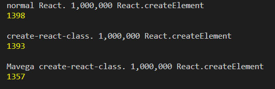

# LGD
- Pulled create-react-class out of react.
- Extended functionality to work for React.PureComponents and React.Component.

# Why to use this module.
create-react-class requires you to change the way you use React.
<b>Forget about getInitialState or getDefaultProps.</b>
Just use state like you normally would and when the react class gets created well initialize the state for you.

``` js
const Obj = {
  create(props) {
    this.state = {
      header: null
    }
  },
  componentDidMount() {},
  componentDidUpdate() {},

  render() {

  }
};
```

We also handle static functions like getDerivedStateFromProps for you so just define it like you would any function. no need to place it inside a statics variable.
``` js
Obj.getDerivedStateFromProps = (props, state) => {

}
```

# Other Modules
- @mavega/oloo
   - Helps with inheritance of Objects.
- @babel/plugin-transform-react-display-name
   - It can help with errors that occur. The name of the Object will show in Stack Trace.

# Vscode Extensions
- JavaScript to Typescript Converter & Syntax Highlighter
   - Help with AutoComplete in vscode for React methods.
   - Helps with inheritance when using plain Objects.
   - Provides Linting of Objects for CreateReactClass.
- JS/React Snippet Extension.

# Speed

<b>
Same speed, sometimes its more, sometimes its a little less.

For Comparison a typically Class takes less than 100 milliseconds to create 1 million times.
</b>



# Guide

``` js
import BaseModal from 'SRC/Modals/BaseModal';
import propTypes from 'prop-types';
import styles from 'SRC/Utilities/Styles';

const { Oloo } = require('@mavega/oloo');
const { createReactPure } = require('@mavega/react');

/**
* @description A modal that helps with handling input from a user.
* the extends doc helps with autocomplete for vscode.
* @type {InputModalType}
* @extends {BaseModalType, React.Component<InputModalProps, InputModalState>}
*/
const InputModal = {
  // Helps with debugging if error occurs. Should be removed in production by babel or something.
  // displayName also works and is ideal.
  constructor: function InputModal() {},
  displayName: 'InputModal',

  staticVariable: 'defined statics here',
  staticNumModals: 0,

  /**
  * @description Initialize an instance of InputModal.
  * This method can return nothing and we will create the react instance using
  * the object passed into the createReactComponent method.
  * @param {InputModalProps} props the props passed by react.
  * InputModalProps gets generated by Extension i mentioned above.
  * @returns {InputModalType}
  */
  create(props) {
    // This sets up a chain of prototypes that will be assigned to a new react instance.
    // Extremely Basic jist is Object.setPrototypeOf(inputModal, baseModal);
    // input.__proto__ === InputModal
    // input.__proto__.__proto__ = BaseModal
    // We will keep this chain on the react class instance so base methods can be used later on.
    const inputModal = Oloo.assign(BaseModal.create(), InputModal);

    // This will get overwritten by the assignment(inputModal.modalStyle) below. We take all the variables added to the inputModal and assign them to the react instance.
    // If you only want to use 'this' then make sure you call create of child like so.
    // BaseModal.create.call(this, arg0, arg1)
    this.modalStyle = {};
    this.index = null;

    inputModal.modalStyle = {
      ...inputModal.modalStyle,
      ...styles.messageBoxStyle
    };

    /**
     * @description This is how you set state of the Object.
     * State can't be used in PureComponent.
     */
    input.state = {
      /**
       * Calling props like this will work even it its not in default props.
       */
      showing: props.showing
      showing: this.props.showing // either works.

      /**
       * You can't access an obj on props if it is not defined in defaultProps.
       */
      fails: props.obj.fails

      /**
       * We defined this in the default props below.
       */
      succeeds: props.existingObj.succeeds

      example: 'Not available in Pure'
    }

    return inputModal;
  },

  componentDidMount() {
    // Use like normal.
    this.index = InputModal.staticNumModals;
    InputModal.staticNumModals++;
  },

  get value() {
    // Works like normal.
  }

  set value() {
    // Works like normal.
  }

  setStateExample() {
    // Works like normal.
    this.setState({ example: 'i changed state' });

    // Statics will work across all instances in React.
    InputModal.staticVariable = 'access statics like this';
  }

  renderBody() {
    return (
      <div>
        <h1>Hi</h1>
      </div>
    );
  },

  render() {
    if(!this.props.showing) {
      return null;
    }

    // this renderModal is a method on BaseModal.
    return this.renderModal(
      this.renderBody(),
      this.modalStyle,
      this.props.onClosed
    );
  }
};

InputModal.getDerivedStateFromProps = (props, state) => {...};

// This is not necessary since we handle
// getDerivedStateFromProps and getDerivedStateFromError.
// Use it like above.
InputModal.statics = { getDerivedStateFromProps(props, state) {...} }

InputModal.defaultProps = {
  existingObj: {
    // Doesn't need to exist for access in create to work.
    // as long as existingObj is assigned as an obj.
    succeeds: true
  }
}

InputModal.propTypes = {
  /**
  * @description Boolean that determines whether we are showing this modal.
  */
  showing: propTypes.bool.isRequired,

  /**
  * @description Function called when we want to close this modal.
  */
  onClosed: propTypes.func.isRequired
};

export const InputModalObject = InputModal;
export default createReactPure(InputModal, optionalOptions);
```

``` js
import InputModal from 'SRC/InputModal';

// Now you can use it like any React Component.
<InputModal />
```

# Release Notes

## 1.2.0+

- Slight Speed improvements.
- Fixed bug that caused certain methods to not maintain inheritance properly.
  - Deeply nested methods are getting maintain properly.
- Improved Debugging.
- Fix bug in development environment where we tried to set proptypes from null obj.

## 1.1.0+

- added statics support.
- No need to have create method anymore.
- Added fallback to base class propTypes if none are defined.
- render could only be on base class now.

## 1.0.0+

- As close to React as possible.
- One Singular Constructor called create().
- Use 'this' in create and receive props.
- Assign defaultProps, propTypes to static Object.
